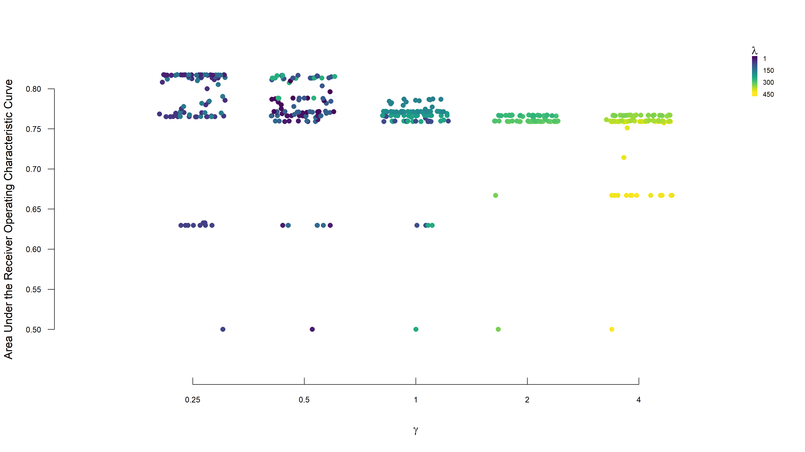
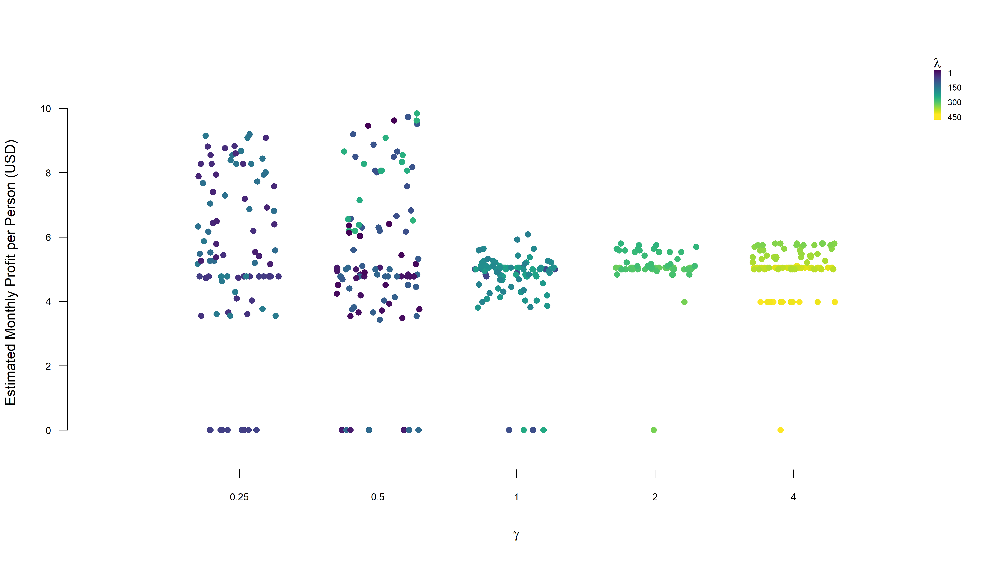
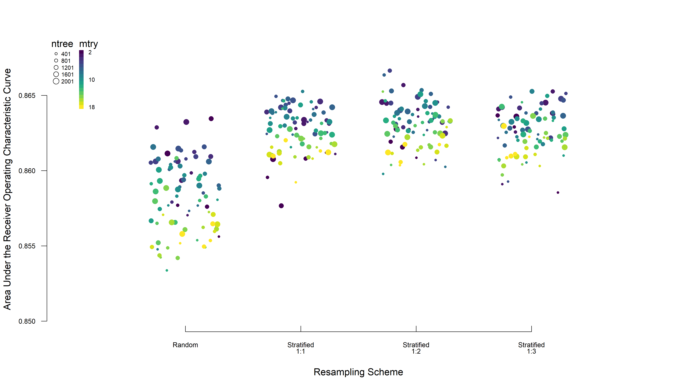
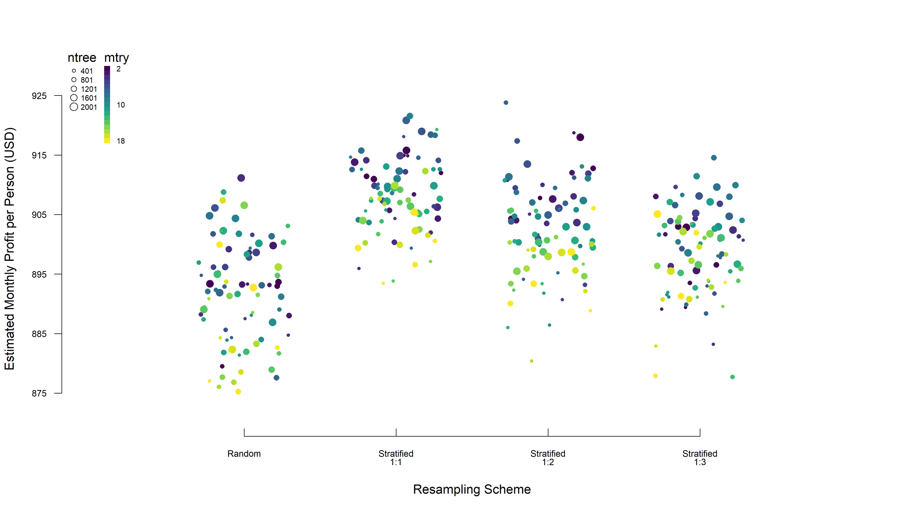
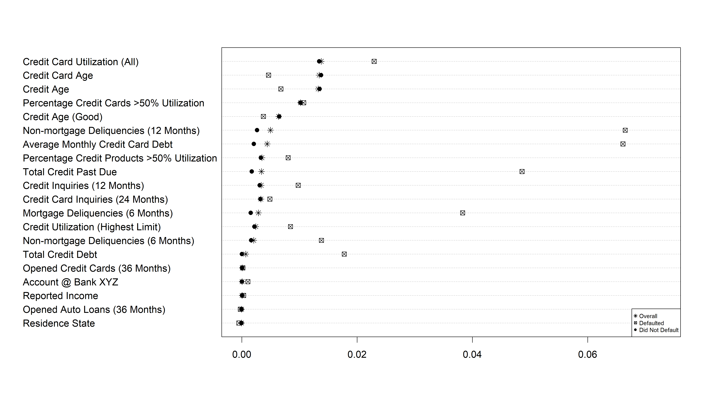
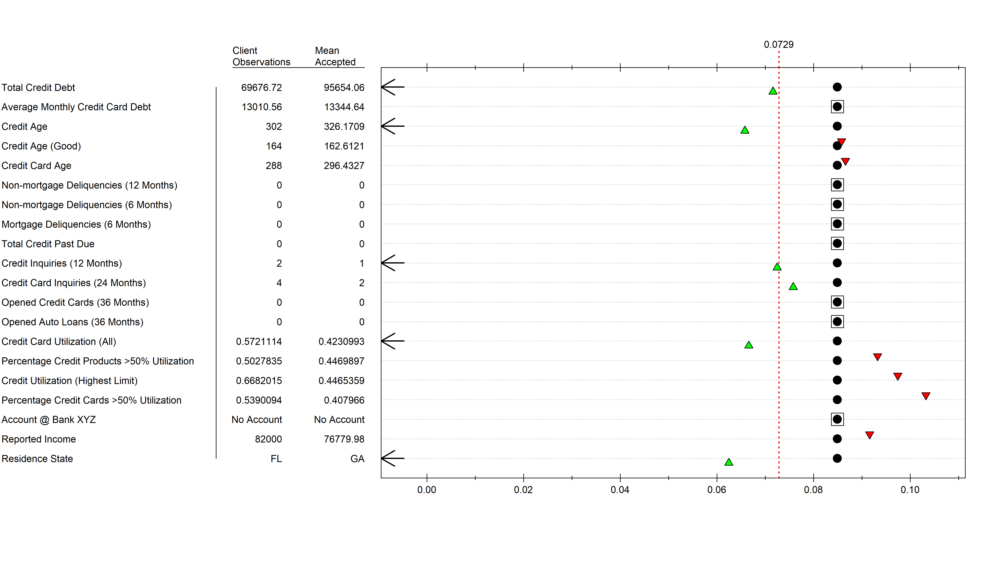

[^epidbios]:Department of Epidemiology and Biostatistics
[^compsci]:Department of Computer Science


```{r setup, include=FALSE}
knitr::opts_chunk$set(echo = FALSE)

my.packages <- c("dplyr", "flextable", "knitr")
lapply(my.packages, library, character.only=T)
```


For more details, please see appendix (add exactly where – figure XXX).


\newpage
# Background {-}

# Competition Prompt

We are expected to work as a team to develop ***credit decision models*** using the simulated datasets for Bank XYZ, to interpret the results, document findings, and present to a panel of judges. 

Specifically, we are asked to   
1. Conduct an exploratory data analysis (Section \@ref(eda))    
2. Develop and fit a logistic regression model (Section @\ref(logistic))    
3. Develop an additional machine learning (ML) model: random forest, gradient boosting, or feedforward neural network (Section \@ref(rf))    
4. Compare the logistic regression model with ML model, select one for credit approval, and describe the reason for our selection (Section \@ref(compare))    
5. Answer the following questions: (Section \@ref(explain))     
  - Do customers who already have an account with the financial institution receive any favorable treatment in our model?      
  - Suppose a credit card application is rejected using our model and the applicant asks us to provide an explanation as to why it was rejected. How would we explain the results to the customer?     


\newpage
# Bank XYZ and Credit Bureaus' Credit Data {-}

# Exploratory Data Analysis {#eda}

## Methods

Data were summarized using means and standard deviations or frequency and percentages as appropriate. For discrete count data, data were summarized using medians and interquartile range. Additional exploratory data analyses were conducted to examine normality of continuous variables and cross-tabulations of categorical variables between outcome levels. Bivariate relationships were examined using correlations (point-biserial between categorical and continuous, and Pearson correlation between continuous variables) and plotted in a correlation matrix (darker colors represent stronger correlations). 


# Results


Table \@ref(tab:table1) shows data summaries for each variable in the training dataset stratified by the Default indicator. 

```{r table1}
load("../../04-Data-Visualization/01-Tables/table_1s.rds")

# training data
## need to remake tables and round their numeric values
flextable(table.1s[[2]][-which(table.1s[[2]]$Levels=="Missing" & table.1s[[2]]$Defaulted=="0 (0)" & table.1s[[2]]$`Did Not Default`=="0 (0)"),] %>% select(-Test)) %>% set_caption("Descriptive Statistics of Training Data") %>% fontsize(part = "all", size = 10) %>% autofit()

```


Figure Correlation Matrix


\newpage
# Modeling and Predicting Probabilities of Account Default {-}

To predict whether or not individuals will default, 2 classes of models were fit: the first was an adaptive LASSO logistic regression model, and the second was a random forest machine learning algorithm for classification. Each model class was fit numerous times on the training data in an exploration of model-specific hyperparameters. All models were then used to classify the observations within the validation dataset. Within each model class, predictive performances were compared by examining differences in area under the curve (AUC) from the receiver operating characteristic curves (ROC). Of the top performing models (AUC in 2.5 percentile), probability thresholds were set according to the financial impact of correct (or incorrect) classification via assigning costs to correctly or incorrectly classifying an individual (Equation \@ref(eq:cost)). 

\begin{equation}
  Profit = TP \times 0 + FP \times 0 + TN \times \mu_1 (p_{merchant} + p_{interest} \times \mu_{delinquencies}) - FN \times \mu_2
  (\#eq:cost)
\end{equation}

where: TP, FP, TN, and FN refer to the frequencies of true positives, false positives, true negatives, and false negatives, respectively; $\mu_1$ and $\mu_2$ are the average monthly credit card debt for an individuals who did not default or who defaulted, respectively; $p_{merchant}$ and $p_{interest}$ are the profit margins for a credit lendor with respect to purchases made (merchant) and interest from late payments (interest); and $\mu_{delinquencies}$ is the average number of delinquencies.[^estimations] 

{^estimations]: A positive in this sense refers to the prediction of Default, where a true positive refers to someone we predicted and who in fact defaulted. The true positives and the false positives were assumed to not have contributed in profit calculations as they represent credit denials (hence zeros in the equation). The average monthly credit card debt for an individual was calculated from the validation dataset using the variable `avg_card_debt` and its geometric mean for the those who did not default ($\mu_1 = \$13097.04$) and defaulted ($\mu_2 = \$13525.80$), separately. We assumed the profit margins on purchases ($p_{merchant}$) and interest payments ($p_{interest}$) to be 1% and 10% of the average monthly credit card debt. The average number of deliquencies ($\mu_{delinquencies} = 0.024$) was calculated using the validation dataset and the `non_mtg_acc_past_due_12_months_num` variable and its quadratic mean for those who did not default divided by 12 (to get monthly). We understand the `avg_card_debt` variable can correspond to many credit cards, but we did not feel capable of estimating an individual's total number of credit cards to correct for this. Also, these calculations were made at the population level and, therefore, assumed the same values for each credit applicant; although, it may be possible to reconfigure to incorporate an individual's data. 

Finally, with a single threshold chosen for each model, the most accurate model (as determined via the distance to corner metric, Equation \@ref(eq:d2c)) was chosen from each model class. 

\begin{equation}
  Distance~to~corner~ (d2c) = \sqrt{(1-sensitivity)^2 + (1-specificity)^2}
  (\#eq:d2c)
\end{equation}

The results presented in this section pertain to model fits on the validation data. 


# Logistic Regression {#logistic}

Our main outcome of interest is whether or not an individual defaults when applying for a credit card. Traditionally, associations between predictors and outcome are tested individually through univariate regression models, then a subset of those covariates are selected for a multivariate regression analysis if univariate analyses yielded significant results. Given the large number of possible predictors, we suspected severe multicollinarity between some pairs of variables, and thus, overfitting of our model. To alleviate this, we “penalized” regression coefficients to select a parsimonious set of variables that leads to similar prediction results. 


## Methods


In a normal logistic regression with a binary outcome, our model is defined by logit(E(Y│X)=β^T (X), where Y is the binary outcome (whether or not an individual defaulted), X = (1,X_1,…,X_p) is the vector of covariate values, and β = (β_0,β_1,…,β_p ) is the vector of regression parameters. In a penalized regression, estimation is generally in the form of an optimization problem that seeks to maximize the function in the form of L(β)-λ*pen(β), where pen(β) is the “penalty” and λ is the “tuning parameter”. The penalty refers to a constraint surrounding the betas and the tuning parameter corresponds to the amount of “shrinkage” applied to the coefficient. In this analysis, an adaptive LASSO (least absolute shrinkage and selection operator) with logistic regression was employed to estimate coefficients and select the most important predictors. Adaptive LASSO is conducted in 2 parts – the first is a “ridge” regression is conducted that uses a penalty proportional to the sum of squares of the regression coefficients and efficiently handles multicollinearity (Equation 1).

  (Equation 1)

The second step is the LASSO step that imposes a constraint on the sum of the absolute value of the regression coefficients and uses data-dependent weights (the inverse of the ridge regression coefficients) to penalize regression coefficients accordingly (Equation 2). Therefore strong predictors’ coefficients are shrunk less than coefficients of weak predictors. 

  (Equation 2). 

Continuous predictors were standardized to have mean 0 and standard deviation 1 before penalized regression was conducted. The main focus of penalized regression is predictive performance rather than uncertainty around the coefficient itself. Confidence intervals for coefficients and predicted probabilities from penalized methods are problematic because coefficients are already biased toward the null because of the inherent penalty term and not presented with regression coefficients. In the table below, we show the standardized coefficient estimates for both ordinary logistic regression and adaptive lasso as well as the shrinkage associated with each coefficient.

The main purpose of LASSO is predictive performance rather than coefficient estimates. We used a training dataset to best inform the penalty and tuning parameters to be used in the LASSO. A validation test set was used to best determine the parameters in our model and our final model's predictive performance was determined by running our model on a testing dataset and record the resulting AUC associated with classifying an individual as one who will or will not default. Moreover, a confusion matrix of actual vs. predicted counts of those who did and did not default was constructed to calculate predictive accuracy, classifications were performed at multiple predicted probability thresholds to determine that which resulted in highest predictive accuracy. To quantify predictive performance of our models, a monetary value was associated with both correctly and incorrectly classifying an individual.
$$ CODY ADD SOMETHING HERE ABOUT MONEY / COST FUNCTION $$

In addition to an adaptive LASSO logistic regression model, a random forest machine learning algorithm was run to compare predictive accuracy 

## Results


Figure Adaptive LASSO
- Training --> ROC & Cost on training and validation datasets

Table
- Coefficients / ORs / Probabilities
- Confusion Matrices


Figure \@ref(fig:lasso-auc)


```{r lasso-auc, fig.width=7.5, fig.height=9/16*7.5, fig.cap = "Adaptive LASSO Logistic Regression Hyperparameters and Areas Under the Receiver Operating Characteristic Curve"}




```


Figure \@ref(fig:lasso-profit)


```{r lasso-profit, fig.width=7.5, fig.height=9/16*7.5, fig.cap = "Adaptive LASSO Logistic Regression Hyperparameters and Estimated Monthly Profit per Applicant"}




```


# Random Forest {#rf}

## Methods


## Results


Figure
- Training --> ROC & Cost on training and validation datasets
- Variable importance
- Proximity?
- "Best" tree?

Table
- Confusion matrices

Figure \@ref(fig:rf-auc)

```{r rf-auc, fig.width=7.5, fig.height=9/16*7.5, fig.cap = "Random Forest Hyperparameters and Areas Under the Receiver Operating Characteristic Curve"}




```


Figure \@ref(fig:rf-profit)

```{r rf-profit, fig.width=7.5, fig.height=9/16*7.5, fig.cap = "Random Forest Hyperparameters and Estimated Monthly Profit per Applicant"}




```


Figure \@ref(fig:rf-importance)

```{r rf-importance, fig.width=7.5, fig.height=9/16*7.5, fig.cap = "Variable Importance in Random Forest Model"}




```


# Model Comparisons {#compare}


```{r}
load("../../04-Data-Visualization/01-Tables/comparisons.rdata")

```


Table \@ref(tab:lasso-confusion)

```{r lasso-confusion}

l.cm.ft %>% set_caption("Confusion Matrix for Adaptive LASSO Logistic Regression Model Predictions on the Test Data")

```


Table \@ref(tab:rf-confusion)

```{r rf-confusion}

r.cm.ft %>% set_caption("Confusion Matrix for Random Forest Model Predictions on the Test Data")

```


Table \@ref(tab:comparison)

```{r comparison}

comparison.ft %>% set_caption("Various Performance Metrics Comparing Predictions on the Test Data from Adaptive LASSO Logistic Regression and Random Forest Models")

```


## Accuracy

Figure 
- ROC & Cost on test data

## Other Considerations

Transparency
...


## Selection


\newpage
# Discussion {-}

The two models developed allows Bank XYZ to predict who may or may not potentially default when asking for a credit card. The first method, an adaptive LASSO with logistic regression allows us to shrink parameters that are not important in predicting whether or not one will default. The 2 stage approach effectively handles feature selection and shrinkage simultaneously to remedy multicollinearity suspected between variables. The second model, the random forest, allows us to calculate several decision trees that ultimately best classify an individual's default decision. In addition to high predictive performance, the random forest allows us to to visualize variable importance, which tells XYZ how much each feature contributes to the prediction. Both models' parameters were tuned by examining fits over a wide range of values for weighting and penalization (LASSO), and number of decision trees /  number of variables sampled at each split (Random Forest). 

Predictive performance for each model was examined by comparing confusion matrices and calculating percentage of those correctly classified. In addition, a cost function was implemented where individuals were assigned a monetary value to allow Bank XYZ to see how much money would be gained or lost depending on how the model classified them. 


# Scenario Application {#explain}

***Do customers who already have an account with Bank XYZ receive any favorable treatment?***

Given the way our logistic regression and random forest models are defined, we are able to say that those who already have an account with Bank XYZ do not receive favorable treatment. This is seen by looking at our variable importance plots and the variable indicating an existing account is the 4th from the bottom and also shows a value of nealy 0 importance, regardless of outcome group.

Was it picked up in any of our models?
What advantage might it have that wouldn't be evident in data?

***Suppose a credit card application is rejected, how would you explain the results to the customer?***

For TP and FP, does it differ? 

Figure
- "Tipping point" plots (if we took any value from specific applicant and replaced with mean of someone who would have been approved, does it change probability enough to cross threshold? iterative combinations of strongest more variable predictors or z-score of particular customer?)


Figure \@ref(fig:example)

```{r example, fig.width=7.5, fig.height=9/16*7.5, fig.cap = "Explanation of A Rejected Applicant"}




```


# Conclusions

Dilemma of basing credit approvals on default data (inherently missing approvals that should have been made, identifying only those that shouldn't have been)


\newpage
# References


```{r eval=F}
knitr::write_bib(x = 
                   c('knitr', 'rmarkdown', 'bookdown', 'dplyr', 'magrittr', 'randomForest', 
                     'parallel', 'doParallel', 'dlookr', 'tidyverse', 'Hmisc', 'corrplot', 
                     'brms', 'caret', 'here', 'skimr', 'DataExplorer', 'pROC', 'patchwork', 
                     'purrr', 'flextable', 'glmnet', 'tibble', 'doRNG'), 
                 file = "./00-References/packages.bib")
```


\newpage
# (APPENDIX) Appendix {-}

## Extended Exploratory Data Analysis


## Training Details

### Class Imbalance

### Cutoff Thresholds


## Cost Rationale


# Table 1s


```{r}
flextable(table.1s[[3]]) %>% set_caption("Descriptive Statistics of Validation Data")
flextable(table.1s[[1]]) %>% set_caption("Descriptive Statistics of Test Data")


```